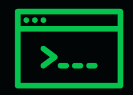

<div align="center">
  

  # CodeQuity Casper Launchpad

  **AI-governed milestone funding for startups, settled through Casper proof rails.**

  [](https://casper.network/)
  [](https://nextjs.org/)
  [](https://supabase.com/)
  [](https://opensource.org/licenses/MIT)

  **Live app:** https://launchpad.codequity.live  
  **Demo path:** investor dashboard -> startup profile -> create round -> Casper wallet signature -> AI evaluation -> milestone release proof
</div>

---

## What CodeQuity Does

CodeQuity is a venture funding protocol where investors commit capital to startups through milestone-based rounds. The milestone logic is governed by an AI traction score and the payment proof is anchored through Casper.

Instead of releasing capital because a founder gave a persuasive update, CodeQuity releases capital when the startup's tracked proof improves: GitHub velocity, product progress, data quality, wallet readiness, and AI-generated due diligence.

The product is built for:

- Investors who want objective, auditable capital release.
- Founders who want to raise against execution instead of network access.
- Accelerators and grant programs that need transparent milestone funding.
- Ecosystem funds that want a programmable way to support early teams.

## The Core Flow

1. A startup profile stores company data, GitHub signal context, traction score, and Casper wallet status.
2. An investor creates a funding round with CSPR amount and milestone thresholds.
3. Casper Wallet signs the deposit deploy or escrow transfer.
4. The AI agent evaluates the startup and persists a due diligence record.
5. If the startup score crosses a milestone threshold, the release path becomes eligible.
6. Casper Wallet signs the release deploy.
7. The round detail page shows milestone status, AI reasoning, and Casper deploy references.

## Why Casper

Casper is a strong fit for this use case because milestone funding is closer to real-world finance than speculative trading. The protocol benefits from Casper's account model, predictable execution, upgradeable contract path, and enterprise-friendly architecture.

CodeQuity uses Casper for:

- Wallet-native investor signatures.
- CSPR deposit and release proofs.
- Escrow contract / escrow wallet settlement modes.
- Testnet deploy hashes linked from round detail pages.
- Future mainnet-grade programmable funding agreements.

## AI Agent Layer

The AI layer is not a chatbot bolted onto the UI. It is part of the funding workflow.

It produces:

- Traction score.
- Verdict and rationale.
- Green flags and red flags.
- GitHub and product signal interpretation.
- Investor memo output.
- Suggested raise readiness improvements.

The important product point: the AI output is persisted and displayed next to the funding round, so judges can see why capital is or is not eligible for release.

## Business Model

CodeQuity can make money through five clear channels:

| Revenue Stream | Customer | Model |
| --- | --- | --- |
| Success fee | Investors / funds | 0.5% to 2% fee on released milestone capital |
| Fund OS subscription | Accelerators, grant programs, angel syndicates | Monthly SaaS fee for dashboards, approvals, reporting, and workflow automation |
| AI diligence reports | Investors and ecosystem partners | Paid per startup report or bundled credits |
| API access | Venture tools, accelerators, grant platforms | Usage-based pricing for score, memo, and signal endpoints |
| White-label launchpad | Universities, ecosystems, corporate venture teams | Setup fee plus platform subscription |

The wedge is hackathon and ecosystem funding, where capital is already milestone-based and transparency matters. From there, CodeQuity expands into accelerator cohorts, angel syndicates, and early-stage venture funds.

## Repository Map

```text
Casper_codequity/
  frontend/                 Next.js app for investors, founders, admins, and docs
  contracts/                Odra/Rust Casper contracts and contract README
  supabase/migrations/      Launchpad database schema and policy migrations
  scripts/                  Casper deployment and environment helper scripts
  docs/                     Submission, architecture, business, and demo documentation
```

## Documentation

- [Product Overview](./docs/overview.md)
- [Architecture](./docs/architecture.md)
- [Business Model](./docs/business-model.md)
- [Technical Setup](./docs/technical-setup.md)
- [Judge Demo Guide](./docs/judge-demo-guide.md)
- [Contracts README](./contracts/README.md)

## Local Setup

### Prerequisites

- Node.js 20+
- npm
- Supabase project or local Supabase CLI
- Casper Wallet browser extension
- Casper testnet account with faucet CSPR
- Optional for contract work: Rust, Odra, and Casper client tools

### Frontend

```bash
cd Casper_codequity/frontend
npm install
npm run dev
```

Open `http://localhost:3000`.

### Frontend Environment

Create `frontend/.env.local`:

```env
NEXT_PUBLIC_SUPABASE_URL=...
NEXT_PUBLIC_SUPABASE_ANON_KEY=...
BACKEND_URL=https://backend.codequity.live
NEXT_PUBLIC_API_URL=https://backend.codequity.live
NEXT_PUBLIC_AUTH_REDIRECT_ORIGIN=http://localhost:3000
NEXT_PUBLIC_CASPER_CHAIN_NAME=casper-test
NEXT_PUBLIC_CASPER_ESCROW_PUBLIC_KEY=...
```

### Database

Apply the migrations in `supabase/migrations` to the Supabase project used by the frontend. Demo data should include:

- At least one startup with `wallet_pubkey`.
- At least one approved investor with `wallet_pubkey`.
- At least one funding round with two milestones.
- At least one agent output record for visible AI proof.

### Contracts

See [contracts/README.md](./contracts/README.md) for Casper contract build and deployment notes.


## Roadmap

- Casper mainnet escrow deployment.
- Stronger contract audit and release policy hardening.
- x402/API monetization for external score and memo access.
- Accelerator/fund admin console.
- Richer signal ingestion: product analytics, revenue proofs, grants, on-chain usage.
- Periodic score anchoring to Casper for tamper-evident diligence history.

## License

MIT
