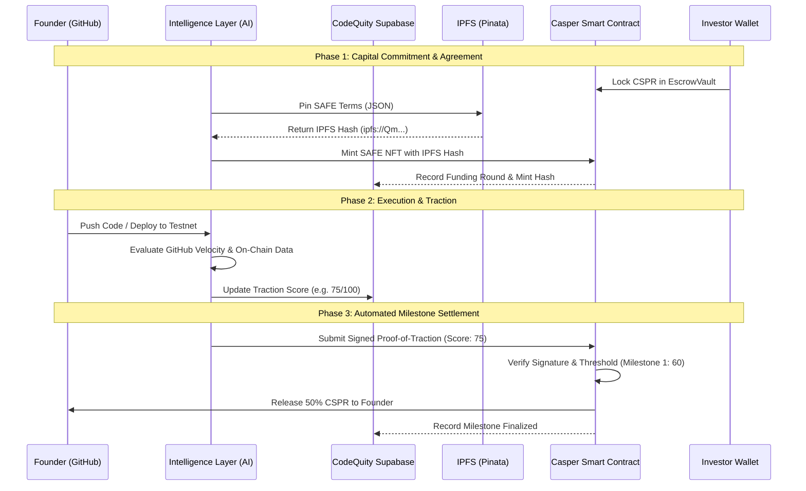

<div align="center">
  

  # CodeQuity
  
  **The Trustless Engine for Programmatic Venture Capital**

  [](https://casper.network/)
  [](https://nextjs.org/)
  [](https://fastapi.tiangolo.com/)
  [](https://supabase.com/)
  [](https://opensource.org/licenses/MIT)

  [**Launchpad**](https://launchpad.codequity.live/) • [**Documentation**](#getting-started) • [**Architecture**](#system-architecture-flow)
</div>

---

## 1. Executive Summary & Narrative

**CodeQuity is fundamentally rewiring how early-stage startups get funded.**

### The Problem
The traditional Venture Capital model is broken. Capital deployment relies on "warm intros," geographic proximity, and subjective human bias. Brilliant technical builders are often ignored simply because they lack the social capital to navigate the Silicon Valley echo chamber. **Your pitch deck is lying to investors, and investors know it.**

### The Solution
CodeQuity introduces the **Threshold Release Engine** and the **Intelligence Layer**—the new financial primitives for Web3 capital allocation. By replacing human VC boards with deterministic AI evaluation and Casper Network smart contracts, we guarantee that funding is distributed based purely on raw, irrefutable technical traction.

Code is truth. When you ship, you get paid.

---

## 2. Technical Architecture & Deep Dive

CodeQuity operates at the bleeding edge of agentic AI and distributed ledger technology.

### The Intelligence Layer
The core of our evaluation logic is the Intelligence Layer. It acts as an aggressive, unbiased data aggregator. It compresses multi-source signals (GitHub velocity, API integrations, on-chain activity, and market dynamics) into a single deterministic integer: **The CodeQuity Traction Score (0-100)**. 

### Smart Contract Integration (The Threshold Engine)
We utilize the **Casper Network** to secure capital and tokenize agreements. Escrow isn't handled by a bank; it is handled by trustless, upgradeable smart contracts written in Odra (Rust). 

Furthermore, every funding agreement is tokenized as a **SAFE NFT**. The terms of the agreement are dynamically generated, permanently stored on the decentralized **IPFS** network via Pinata, and cryptographically bound to the NFT metadata on the Casper blockchain. 

When the Intelligence Layer verifies that a startup has hit a milestone threshold, it generates cryptographic "Proof-of-Traction" evidence. This signed payload is broadcasted to the Casper RPC, instantly triggering the automated release of CSPR directly to the founder's wallet.

### System Architecture Flow



---

## 3. Key Features

- **Automated Milestone Settlement**: Removing human friction from capital deployment. Once a threshold is set, the funds are cryptographically bound to the startup's execution. No board meetings. No delays.
- **Decentralized SAFE Agreements**: Every investment is backed by an on-chain SAFE NFT on the Casper network, with the deal terms permanently pinned to IPFS to guarantee immutability.
- **Audit-Ready Evidence**: Every release is backed by immutable, on-chain evidence. Investors can track the exact block, hash, and cryptographic signature that justified the release of their capital.
- **AI-Driven Deal Sourcing**: Objectively identifying winners before they hit consensus. Our engine strips away the narrative to find the teams that are actually shipping robust, secure code.
- **Wallet-Native Transfers**: Optional bypass of heavy smart contracts. Investors can authorize direct P2P milestone transfers from their Casper Wallet, reducing friction while maintaining programmatic scoring logic.

---

## 4. Getting Started

### For Founders (Prove Your Worth)
1. **Register**: Sign in to the CodeQuity Launchpad.
2. **Connect**: Link your GitHub repositories and Web3 wallets to the Intelligence Layer.
3. **Configure**: Define your target raise and the score milestones (e.g., 50% release at Score 60, 50% at Score 80).
4. **Execute**: Start shipping code. Watch your score climb and your capital unlock automatically.

### For Investors (Deploy Capital Programmatically)
1. **Browse**: Access the Launchpad to view startups ranked purely by objective traction.
2. **Commit**: Select a startup and define your investment amount (CSPR).
3. **Escrow**: Use your Casper Wallet to securely lock funds into the milestone contract (or the platform escrow wallet).
4. **Monitor**: Track real-time execution via the dashboard. Capital is protected until the founder delivers.

### Environment Setup (Local Development)

#### Prerequisites
- **Node.js** (v18+) & **npm/pnpm**
- **Python** (v3.10+)
- **Rust** & **Odra** (for Casper Smart Contracts)
- **Supabase CLI**

#### 1. Backend Integration (FastAPI)
```bash
cd backend
python3 -m venv .venv
source .venv/bin/activate
pip install -r requirements.txt
# Ensure CASPER_NODE_URL and CASPER_ESCROW_PUBLIC_KEY are set in .env
uvicorn main:app --reload
```

#### 2. Frontend Dashboard (Next.js 14)
```bash
cd frontend
npm install
# Ensure NEXT_PUBLIC_CASPER_ESCROW_PUBLIC_KEY is configured in .env.local
npm run dev
```

#### 3. Database (Supabase)
```bash
npx supabase start
npx supabase migration up
```

---

## 5. Security & Trust Model

In Web3, trust is not assumed—it is mathematically guaranteed.

- **Verification Logic**: How does CodeQuity ensure data isn't spoofed? The Intelligence Layer cross-references GitHub commit signatures with actual deployed smart contract bytecodes. Spammed commits are filtered out by our semantic analysis engines.
- **Escrow Security**: Investor funds are routed through non-custodial Casper smart contracts or highly-secure, multi-sig escrow architecture. The platform itself cannot arbitrarily drain funds.
- **Transparency**: CodeQuity provides an "Auditable Trust" record. Every interaction—from round creation to milestone finalization—is recorded on the Casper testnet and linked directly in the frontend dashboard.

---

<div align="center">
  <i>Developed for the Casper Network Ecosystem by CodeQuity.</i><br>
  <b>Code is Truth.</b>
</div>
