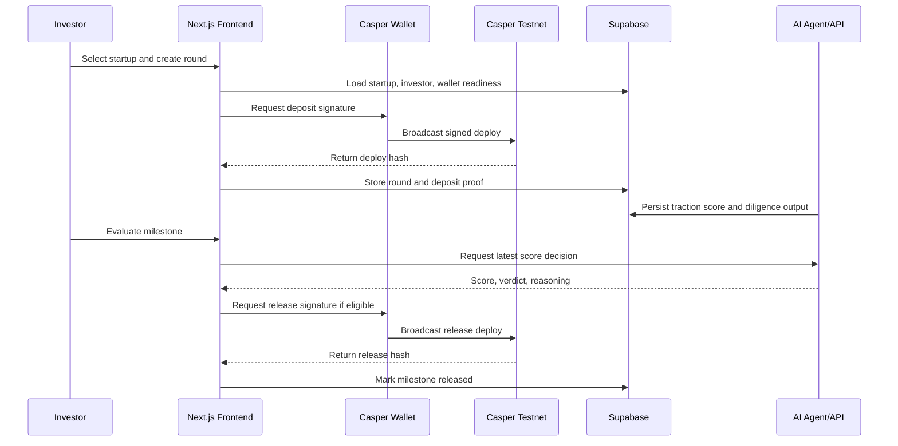

# Architecture

## System Summary

CodeQuity is built as a web launchpad with Supabase for application data, Casper Wallet for user signatures, Casper testnet for transaction proof, and an AI/backend layer for scoring and memo generation.

```text
Investor / Founder
      |
      v
Next.js Frontend
      |
      +-- Supabase Auth and Database
      |
      +-- Backend Agent/API Layer
      |
      +-- Casper Wallet Extension
              |
              v
        Casper Testnet
```

## Main Components

### Frontend

Location: `frontend/`

Responsibilities:

- Landing page and product narrative.
- Investor dashboard.
- Startup profile pages.
- Funding round creation.
- Casper Wallet connection and signing.
- Round detail pages with proof rails.
- In-app documentation.

Key technologies:

- Next.js App Router.
- React.
- TypeScript.
- Tailwind CSS.
- Supabase client/server helpers.
- Casper JS SDK.

### Supabase

Location: `supabase/migrations/`

Responsibilities:

- Store startups.
- Store investors.
- Store funding rounds.
- Store milestones.
- Store agent outputs.
- Store wallet public keys.
- Enforce profile and approval rules.

Important tables include:

- `startups`
- `investors`
- `funding_rounds`
- `milestones`
- `agent_outputs`

### AI Agent/API Layer

Responsibilities:

- Score startups.
- Generate investor memos.
- Enrich startup data.
- Persist outputs into Supabase.
- Return score data used by the frontend release workflow.

Relevant endpoint families:

- `POST /api/agents/score`
- `POST /api/agents/score/stream`
- `POST /api/agents/memo`
- `POST /api/agents/memo/stream`
- `POST /api/agents/enrich/{startup_id}`

### Casper Wallet

Responsibilities:

- Connect the investor or escrow wallet.
- Sign CSPR deposit deploys.
- Sign milestone release deploys.
- Provide public keys for wallet validation.

The frontend validates that the connected wallet matches the required role before the user signs critical actions.

### Casper Proof Layer

Responsibilities:

- Provide transaction proof for deposits and releases.
- Support wallet escrow and contract escrow modes.
- Show deploy hashes and explorer references in the UI.
- Prepare the protocol for mainnet contract hardening.

Contract workspace:

- `contracts/escrow-vault`
- `contracts/safe-token`

## Funding Round Lifecycle



## Trust Boundaries

CodeQuity has three important trust boundaries:

- The AI layer can explain and recommend, but the UI must show the reasoning and source context.
- The wallet signs final money-moving actions, so users see the transaction before submission.
- Casper provides durable transaction references for deposit and release events.

## What Is On-Chain vs Off-Chain

| Layer | Stored On-Chain | Stored Off-Chain |
| --- | --- | --- |
| Casper | Deploy hashes, transfer/release proof, contract state in contract mode | Full startup profile and AI memo |
| Supabase | None directly | App records, rounds, milestones, wallet keys, AI outputs |
| AI/API | None directly | Score, rationale, signals, reports |
| Frontend | None directly | User session state and UI workflow |

## Reliability Notes

- Wallet mismatch states are handled before signing.
- Missing startup wallet states block or warn in funding workflows.
- Milestone release requires score eligibility.
- Round detail surfaces missing proof as pending rather than broken.
- Demo should include seeded data so judges are not blocked by empty states.
