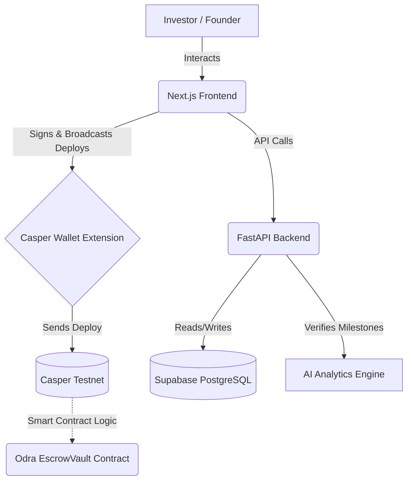

# Codequity Casper Integration: Full Architecture Walkthrough

This document provides a comprehensive overview of the **Codequity Launchpad** architecture, detailing how the Next.js Frontend (`Casper_codequity`), the Odra Smart Contracts (`contracts`), and the FastAPI Backend (`codequity-analytics`) work together to create a decentralized, milestone-based funding platform on the Casper Network.

---

## 🏗️ 1. High-Level Architecture

The platform consists of three main pillars:
1. **Frontend (Client-Side)**: Handles user interaction, Casper Wallet connection, and broadcasts transactions directly to the Casper Testnet.
2. **Backend (Server-Side)**: Acts as an indexer and AI verification engine. It manages the Supabase database and evaluates startup performance.
3. **Smart Contracts (On-Chain)**: Written in Odra (Rust), managing the secure escrow of CSPR tokens and enforcing release rules.

---

## 🖥️ 2. The Frontend (`Casper_codequity/frontend`)

Built with **Next.js**, the frontend is the bridge between the user's Casper Wallet and the Codequity ecosystem. We utilize the `casper-js-sdk` (v2.15.1) to construct and broadcast deploys.

### Key Components

- **`CreateRoundForm.tsx`**: 
  - **Purpose**: Allows investors to fund a startup by creating a milestone-based round.
  - **Casper Flow**: 
    1. Constructs a CSPR `Transfer` deploy using `DeployUtil`.
    2. Requests the user's signature via `window.CasperWalletProvider`.
    3. Manually reconstructs the signed deploy by injecting the hex signature into the `deploy.approvals` array.
    4. Broadcasts the deploy to the public Casper Testnet RPC.
    5. Sends the `deploy_hash` to the FastAPI backend to register the round in the database.

- **`EvaluateRoundButton.tsx`**: 
  - **Purpose**: Allows investors to release funds for a specific milestone.
  - **Casper Flow**: 
    1. Checks with the backend if the startup has met the AI score requirements for the milestone.
    2. If eligible, constructs a smart contract call (to the `EscrowVault`) targeting the `release` entrypoint.
    3. Signs and broadcasts the deploy to Casper, executing the release of funds to the startup's wallet.

---

## ⚙️ 3. The Backend (`codequity-analytics`)

Built with **FastAPI (Python)**, the backend is strictly an indexer, database manager, and AI evaluator. It does **not** hold private keys or sign transactions, keeping the platform non-custodial.

### Key Endpoints (`routers/launchpad.py`)

- **`POST /api/launchpad/rounds`**
  - **Trigger**: Called by the frontend immediately after an investor broadcasts their initial funding deposit.
  - **Action**: Validates the payload, records the `deploy_hash` and `investor_signature`, and provisions the funding round and its associated milestones in the Supabase `funding_rounds` and `milestones` tables.

- **`POST /api/launchpad/evaluate`**
  - **Trigger**: Called when an investor clicks "Evaluate score release".
  - **Action**: The backend analyzes the startup's current Github/Traction metrics (the "AI Score"). If the score exceeds the milestone's target, the backend updates the milestone status to `released` in the database and returns a success payload to the frontend, authorizing the frontend to execute the on-chain smart contract release.

> [!TIP]
> **Shift to Client-Side Signing**
> Initially, the backend was designed to execute Casper deploys itself using a server-side private key (via Python's `casper-client`). We successfully refactored this so that **all transactions are signed by the user via the Casper Wallet extension on the frontend**, ensuring proper decentralization and security.

---

## 🔗 4. Smart Contracts (`Casper_codequity/contracts`)

Written using the **Odra Framework (Rust)**, the contracts ensure funds are locked securely and only released when rules are met.

- **`EscrowVault`**: The primary contract holding the CSPR.
  - **State**: Tracks milestones, amounts, and completion status.
  - **`release()` function**: An entrypoint that accepts a `milestone_index` and a `recipient` (startup's public key). It transfers the allocated CSPR from the contract's purse to the startup's purse.

---

## 🔄 5. Step-by-Step User Flow

### Phase 1: Funding a Startup
1. **User Action**: Investor enters an amount (e.g., 50 CSPR) and defines milestones in the Launchpad UI.
2. **Wallet Signature**: Casper Wallet prompts the user to sign a 50 CSPR transfer to the platform's Escrow.
3. **Broadcast**: The frontend broadcasts the signed transaction to `node.testnet.casper.network`.
4. **Database Sync**: The frontend sends the deploy hash to the FastAPI backend, which creates the Round in Supabase.

### Phase 2: Milestone Verification & Release
1. **User Action**: Sometime later, the investor clicks "Evaluate score release" on a pending milestone.
2. **AI Check**: The backend verifies the startup's github/analytics score. 
3. **Contract Execution**: If the score passes, the Casper Wallet prompts the investor to sign a contract call to the `EscrowVault`.
4. **Payout**: The frontend broadcasts the signed contract call, and the Escrow contract transfers the funds to the startup!
